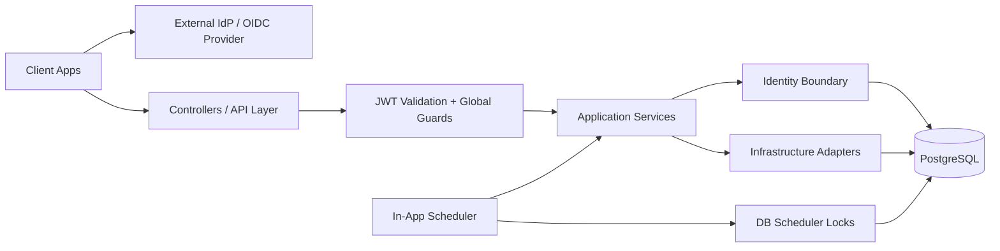

# Backend API Template

A production-ready NestJS backend reference with explicit boundaries, deterministic behavior, and full auditability.

**Built with AI-assisted development** — the documentation layer is explicitly structured for both humans and AI agents. See [`agents.md`](agents.md) for the agent-oriented navigation map.

---

## Tech Stack

| Layer | Technology |
|-------|------------|
| Framework | [NestJS](https://nestjs.com/) + TypeScript |
| Database | PostgreSQL + [Prisma ORM](https://www.prisma.io/) |
| Auth | JWT/OIDC validation (external provider) + RBAC |
| Cache / Rate Limiting | Redis with in-memory fallback |
| Scheduler | In-app cron with PostgreSQL row-level locking |
| Email | Console / SparkPost / AWS SES adapters |
| Push | Expo Push Token adapter |
| Testing | Jest + Supertest E2E |

---

## Key Features

| Feature | Description | Docs |
|---------|-------------|------|
| **Externalized Auth** | JWT signature, issuer, audience, and role validation with fail-fast startup checks | [`AUTH_CONTRACT.md`](docs/canonical/AUTH_CONTRACT.md) |
| **RBAC** | Global guards + `@Roles()` decorator with identity-status enforcement | [`AUTHORIZATION_FLOW.md`](docs/canonical/AUTHORIZATION_FLOW.md) |
| **GDPR Compliance** | Export pipeline, deletion lifecycle, suspension/recovery, and legal holds | [`GDPR_INVARIANTS.md`](docs/canonical/GDPR_INVARIANTS.md) |
| **Notifications** | Intent → cron materialization → delivery audit with email & push hooks | [`NOTIFICATIONS_ARCHITECTURE.md`](docs/canonical/NOTIFICATIONS_ARCHITECTURE.md) |
| **Rate Limiting** | Redis-backed token bucket with resilient in-memory fallback | [`RATE_LIMITING.md`](docs/canonical/RATE_LIMITING.md) |
| **Scheduler** | Multi-instance-safe cron using DB advisory locks | [`SCHEDULING.md`](docs/canonical/SCHEDULING.md) |
| **Testing** | 15+ E2E suites covering auth, GDPR, notifications, and lifecycle | [`TESTING.md`](TESTING.md) |

---

## System Diagram



---

## Design Philosophy

- **Boring backend:** explicit over clever, deterministic over implicit.
- **Template neutrality:** no provider SDK coupling, no product-specific domain logic.
- **Fail-fast safety:** auth misconfiguration and unsafe production modes fail at startup.
- **Defensibility:** critical decisions are documented with explicit invariants.

---

## Quick Start

1. Copy `.env.example` to `.env` and fill in your JWT provider details.
2. Run `npm install` then `npx prisma migrate dev`.
3. Start: `npm run start:dev`

Full setup: [`docs/guides/SETUP.md`](docs/guides/SETUP.md)  
All commands: [`QUICK-START.md`](QUICK-START.md)

---

## Documentation Map

### Architecture & Contracts

| Topic | Entry Point |
|-------|-------------|
| High-level architecture | [`Architecture.md`](Architecture.md) · [`docs/canonical/ARCHITECTURE.md`](docs/canonical/ARCHITECTURE.md) |
| Auth & authorization | [`Security.md`](Security.md) · [`AUTH_CONTRACT.md`](docs/canonical/AUTH_CONTRACT.md) · [`AUTHORIZATION_FLOW.md`](docs/canonical/AUTHORIZATION_FLOW.md) |
| GDPR | [`GDPR.md`](GDPR.md) · [`GDPR_INVARIANTS.md`](docs/canonical/GDPR_INVARIANTS.md) |
| Notifications | [`NOTIFICATIONS.md`](docs/canonical/NOTIFICATIONS.md) · [`NOTIFICATIONS_ARCHITECTURE.md`](docs/canonical/NOTIFICATIONS_ARCHITECTURE.md) |
| Scheduling | [`Scheduler.md`](Scheduler.md) · [`SCHEDULING.md`](docs/canonical/SCHEDULING.md) · [`CRON_OBSERVERS.md`](docs/canonical/CRON_OBSERVERS.md) |
| Rate limiting | [`RATE_LIMITING.md`](docs/canonical/RATE_LIMITING.md) |

### Guides & Operations

| Topic | Entry Point |
|-------|-------------|
| Setup | [`docs/guides/SETUP.md`](docs/guides/SETUP.md) |
| Deployment | [`docs/guides/DEPLOYMENT.md`](docs/guides/DEPLOYMENT.md) |
| Scripts & CI | [`scripts/SCRIPTS_ARCHITECTURE.md`](scripts/SCRIPTS_ARCHITECTURE.md) |

### Architecture Decision Records

Key design decisions with context and trade-offs: [`docs/adr/`](docs/adr/)

### Agent Documentation

Structured docs for AI-assisted development: [`agents.md`](agents.md)

---

## Project Structure

```
src/
├── common/           # Auth, guards, filters, rate-limiting, Prisma
├── config/           # Environment validation & typed config service
├── infrastructure/   # Email, Redis, scheduler, cleanup jobs
└── modules/          # Domain modules: identity, profiles, GDPR, notifications, reports, health
test/                 # E2E specs: auth, GDPR, notifications, lifecycle
docs/
├── adr/              # Architecture Decision Records
├── canonical/        # System contracts and invariants
├── guides/           # Setup, deployment, troubleshooting
└── infrastructure/   # Cron & delivery contracts
scripts/
├── ci/               # CI validation scripts
├── dev/              # Dev helpers & scenario runners
└── ops/              # Operational jobs & admin CLI
```
