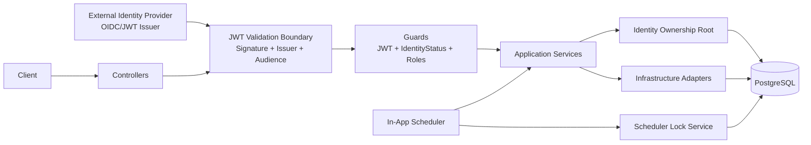

> Documentation Layer: Canonical Contract

# Architecture

This document is the senior-level architectural narrative for the public reference backend.
It describes boundaries, invariants, and safety assumptions.

## System Narrative

The system is intentionally split into clear responsibilities:

- **External authentication boundary**: an OIDC-compatible provider authenticates users and issues JWTs.
- **Backend boundary**: this repository validates JWTs, enforces role-based authorization, and executes domain/infrastructure workflows.
- **Persistence boundary**: PostgreSQL is the source of truth for domain state, GDPR state, and scheduler coordination state.

The design goal is operationally boring behavior under normal and failure conditions.

## Module Boundaries

### Entry Layer (Controllers)

- HTTP controllers expose API routes and map DTOs to application calls.
- Controllers do not perform business authorization logic directly.
- Global guard stack applies first: JWT auth, identity-status enforcement, role guard.

### Application Services

- Application services orchestrate domain actions, policy checks, and infrastructure calls.
- Services are where invariants are enforced (ownership, lifecycle transitions, idempotency).

### Domain Layer

- Domain concerns are implemented in feature modules under `src/modules/*`.
- Ownership is identity-rooted (through `identityId`), never token-rooted.

### Identity Boundary

- Identity records map external `sub` to internal ownership anchor.
- Identity state flags (`deletedAt`, `anonymized`, `isSuspended`) are authoritative for access and lifecycle enforcement.

### Infrastructure Adapters

- Infrastructure modules (email, scheduler, redis/rate-limit, storage adapters) are implementation details behind domain workflows.
- Provider details remain environment-driven and replaceable.

### Scheduler / Background Processing

- Scheduler orchestration is infrastructure-level.
- Job logic remains in application/domain services.
- Locking is handled via database-backed scheduler lock service.

## Architecture Diagram

### Diagram Invariants

- External IdP is decoupled from domain persistence.
- JWT claims are request-boundary inputs, not domain storage.
- Domain tables reference `identityId`, not JWT `sub` directly.
- Scheduler coordination is persisted in DB lock rows, not in memory.

## API Structure

- API is versioned and exposed through the entry layer.
- Public endpoints are explicitly annotated.
- Authenticated endpoints require validated JWT and pass through identity/role guards.

## Identity Model & Ownership Enforcement

### Ownership Root

- **Identity is the ownership root** for user-owned domain data.
- Domain rows use `identityId` foreign keys.
- Profile is a representation layer, not an ownership anchor.

### Why JWT `sub` is Not Stored in Domain Tables

- `sub` is external-provider identity material at request time.
- Persisting provider-bound IDs across domain tables couples the model to an auth provider.
- Identity indirection allows provider replacement without rewriting domain ownership links.

### Lazy Identity Creation

- On first valid authenticated request, identity can be created if missing.
- This removes backend-side registration coupling while preserving strict ownership anchors.

### Deletion Lifecycle Alignment

- Deletion follows the two-phase lifecycle (`deletedAt` grace period → `anonymized` final state).
- Access blocking is backend-enforced via identity status checks.
- This supports GDPR reversibility windows and auditable transitions.

### Enforcement Boundaries

- Auth provider authenticates the actor.
- Backend authorizes and enforces lifecycle restrictions.
- Identity state in DB is authoritative for access decisions.

## JWT Validation Boundary

JWT processing is strict and explicit:

- Signature verification against configured key strategy
- Issuer verification against `JWT_ISSUER`
- Audience verification against `JWT_AUDIENCE`
- Expiration validation
- Subject (`sub`) required

### Role Extraction Order (Provider-Agnostic)

Roles are extracted from the first matching location in this order:

1. `app_metadata.roles`
2. `user_metadata.roles`
3. `realm_access.roles`
4. `roles`

Unknown roles are ignored; canonical role set remains fixed (`USER`, `ENTITY`, `ADMIN`, `SYSTEM`).

## Scheduler Concurrency & Locking Strategy

The scheduler is designed for multi-instance deployments where multiple replicas may tick at the same wall-clock time.

### Locking Model

- Each schedule acquires a DB-backed lock by job name.
- Lock rows include holder and expiry (`expiresAt`).
- If lock is held and unexpired by another instance, execution is skipped.
- Lock is released/expired after execution; stale locks can be cleaned.

### Idempotency Strategy

- Scheduled jobs are expected to be idempotent at the service/data layer.
- Retry/cleanup operations target explicit terminal states and bounded windows.
- Re-running a completed step should produce no incorrect duplicate side effects.

### Failure Safety

- Lock acquisition failures do not execute the job.
- Crashed instances are bounded by lock TTL and stale-lock cleanup.
- Job-level failures are isolated; scheduler loop continues.

### Horizontal Scaling Safety Invariants

- At-most-one active lock holder per schedule key (within lock TTL window).
- Shared DB lock state coordinates all replicas.
- No in-memory lock assumption across processes.

## Concurrency Philosophy

- Critical coordination belongs to the database source of truth.
- In-memory state is process-local and not authoritative for distributed safety.
- Concurrency safety is explicit via persisted lock and state transitions.

## Security & Threat Model Assumptions

### What the Backend Protects Against

- Invalid or forged JWTs (signature/issuer/audience mismatch)
- Unauthorized role escalation via unrecognized claims
- Access to suspended/pending-deletion/deleted identities
- Multi-instance scheduler duplicate execution via lock coordination
- Unauthorized data ownership access through identity-rooted checks

### What the Backend Explicitly Does Not Protect Against

- Credential theft at identity-provider/client layer
- Token issuance compromise at external IdP
- Network-layer DDoS protection by itself
- Implicit endpoint rate limiting when route tiers are not configured

### Infrastructure Assumptions

- Database availability is required for authoritative state and lock coordination.
- Environment variables are correctly provisioned per deployment environment.
- External IdP publishes valid keys/issuer/audience for configured JWT mode.

### Explicit Security Guarantees

- JWT validation boundary always checks signature + issuer + audience.
- Role enforcement is internal and based on canonical role filtering.
- Client payload is never trusted without DTO validation and guard enforcement.
- Scheduler execution relies on lock acquisition and idempotent service behavior.
- Database remains source of truth for ownership and lifecycle state.

### Explicit Exclusions

- No token issuance
- No session storage
- No implicit global rate limiting guarantee

## Non-Goals

This repository intentionally does **not** include:

- Auth provider SDK coupling
- Login/logout/OAuth flow implementation
- Token issuance or token refresh workflows
- Product-specific domain logic
- Multi-tenant isolation beyond identity ownership modeling
- Mandatory distributed cache requirement
- Background job framework abstraction layer beyond current scheduler contract

These are deliberate constraints to preserve clarity, portability, and template neutrality.

## Design Philosophy: Boring Backend

Public exposure does not justify extra complexity.

- Explicit contracts over hidden conventions
- Predictable failure over silent fallback
- Stable primitives over trendy abstractions
- Auditability over novelty

